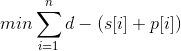

# Machine Task Allocation Optimization

### Install linux dependencies

```shell script
sudo apt update
sudo apt install build-essential \
                 software-properties-common \
                 python3-pip \
                 python3-distutils
```

### Create environment and install python dependencies

```shell script
pip3 install virtualenv
virtualenv venv
source venv/bin/activate
pip install -r requirements.txt
```

### Instance

Um conjunto de _n_ tarefas, cada uma com tempo de processamento _p[i]_ não negativos
, _i=f, ..., n_ e número _m_ de máquinas disponíveis e um deadline _d_.

### Solution

Determinar:

- _(i)_ uma distribuição das tarefas às máquinas, tal que cada tarefa esteja em exatamente
uma máquina;

- _(ii)_ tempos de início _s[i]_, _i=1, ..., n_, de cada tarefa, tal que tarefas na mesma
máquina não tenham sobreposição durante as execuções, e tal que nenhuma tarefa
termine depois do deadline.
    
### Goal

Minimizar o tempo de espera total das taredas antes do deadline, ou seja,



### Instance format

- 1ª linha: número de máquinas
- 2ª linha: número de itens _n_
- 3ª linha: due date _d_
- _i_ linhas seguintes: tempos de processamento das tarefas
